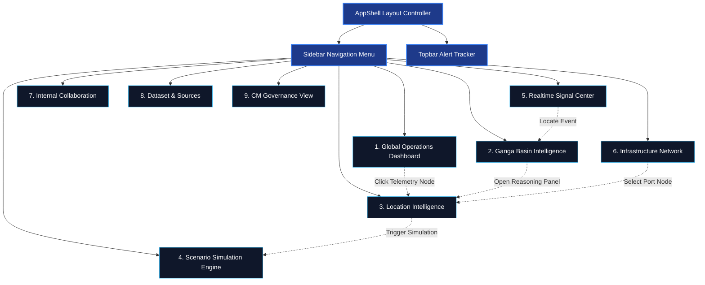

# Namami Gange Platform — Sovereign Operational Intelligence
## Review Packet: Design System, Layout Architecture & Strategic UX

> [!IMPORTANT]
> This review packet serves as the comprehensive strategic authority and visual direction for the Namami Gange Platform. It establishes a government-grade, decision-friendly geospatial intelligence surface that balances sovereign seriousness with environmental and operational calmness.

---

## 1. Design Philosophy: "Sovereign Operational Intelligence"

The Namami Gange Platform is designed as a **sovereign decision surface** representing real-world infrastructure and river systems. Unlike consumer SaaS panels that prioritize engagement metrics, or gaming-centric dashboard designs that utilize high-contrast "neon-cyberpunk" aesthetics, this platform is engineered for **Operational Calmness**.

* **Civilizational Calmness**: Drawing inspiration from the deep, vast colors of Indian river basins and high-precision scientific surfaces (e.g., ISRO, space telemetry, marine command centers).
* **Map-Centric Information Layering**: The map is not a layout widget; it is the viewport of truth. Panels, details, and telemetry cards emerge organically as layers from the map, ensuring spatial-visual continuity.
* **Seriousness of Data**: Visual priority is given to trace codes, confidence indices, and telemetry sensors to establish absolute governance, traceability, and operational speed.
* **Non-Militarized Authority**: Designed for civilian administrators, logistics managers, and ministry leadership. The interface projects high-grade security, readiness, and strategic intelligence without appearing visually aggressive.

---

## 2. Navigation Architecture & UI Flow

The platform separates features into logical domains, allowing seamless transition from a macro view to micro telemetry details. 



---

## 3. Design System & Style Guide

### Core Color Palette
To project operational stability and readability under long shifts:

| Color Token | HEX Value | Usage & Meaning |
| :--- | :--- | :--- |
| **Deep Space Navy** | `#050a14` | Primary Application Canvas (reduces eye strain) |
| **Vapor Surface Blue** | `#0a1120` | Cards, side panels, and elevated containers |
| **River Flow Blue** | `#1e88e5` | Water systems, navigable paths, and base overlay lines |
| **Teal Glow** | `#00bfa5` | Luminous status indicators, high confidence scores, and normal limits |
| **Alert Orange** | `#ff9100` | Degraded telemetry, anomalies, warning zones, and siltation indicators |
| **Alert Red** | `#ef4444` | Critical thresholds, environmental risk zones, and offline devices |
| **Eco Green** | `#10b981` | Restored basins, forest covers, and opportunity corridors |
| **Amber** | `#fbbf24` | National highways, intermodal rail networks, and logistics infrastructures |

### Typography Hierarchy
* **Primary Display**: `Syne` (Geometric, confident, sovereign structure for logos, headers, and strategic values).
* **Telemetry & Data**: `Space Mono` (Fixed-width numeric layouts for coordinate systems, sensor scales, and IDs).
* **Body / System Text**: `Inter` (Neutral, highly readable neutral-grotesque font optimized for high information densities).

---

## 4. Core Page Intelligence Logic (All 9 Screens)

### 1. Global Operations Dashboard
The primary landing dashboard interface.
* **Geospatial Focus**: Centered on an SVG map of India. Dynamic layer overlays show key waterways (NW-1 to NW-111) and coastal ports.
* **Signal Stream**: A side panel streams real-time alerts. Critical alerts display animated ripple rings directly on the map.
* **Strategic Indicators**: Top panel highlights total Active Signals (128), Critical Anomalies (23), and Monitored Locations (1,247).

### 2. Ganga Basin Intelligence View
A high-resolution river deep-dive.
* **Hydrography Overlay**: Stylized river path featuring suitability highlights (color-coded by water quality and depth).
* **Telemetry Nodes**: Clickable markers for Barrages, Jetties, Waterway Ports, and Bridges.
* **Interactive Panel**: Clicking any node opens a reasoning sidebar synthesizing sensor readings (BOD, DO, flow rate, silt levels).

### 3. Location Intelligence Page
Granular analysis of a single segment (e.g., Varanasi Hub or Kanpur Industrial corridor).
* **Suitability Index**: Dynamic visual circular gauges showing composite compatibility rankings.
* **Constraint Matrices**: Tracks factors (Siltation risk, flow variation, habitat constraints, logistics networks).
* **Historical Trace**: Shows unique Tracer IDs (e.g., `ND-120-2026-0408`) linking active data points to their original databases.

### 4. Scenario Simulation Page
Predictive modelling interface for "what if" planning.
* **Comparative Layout**: Two side-by-side SVG basin representations displaying Baseline vs. Optimized simulations.
* **Sliders**: Controls priorities (Eco-preservation vs. Economic transport capacity).
* **Delta Feed**: Real-time stats detail computed changes (e.g., `+18% suitability`, `-12% high-risk area`).

### 5. Realtime Signals / Events Page
Chronological event stream detailing environmental anomalies.
* **Event Ledger**: Complete tracking of incoming warnings, anomalies, and observations.
* **Trace Metadata**: Unique Trace IDs for every entry to ensure complete audit trails.
* **Confidence Ratings**: Horizontal confidence meters (0% - 100%) indicating sensor stability.

### 6. Infrastructure Network View
Visualizes intermodal connectivity.
* **Multi-Layer Mapping**: Displays interconnected waterways, highways, railways, and logistics parks.
* **Network Health**: Luminous gauges display calculated intermodal connectivity status.

### 7. Internal Collaboration Layer
Operational coordination hub for decision makers.
* **Operational Channels**: Categorized chat threads (`#ganga-intelligence`, `#maritime-ops`).
* **Active Call Panel**: Keeps operators connected with active audio/video feeds, screen shares, and map overlays during crisis periods.

### 8. Dataset / Source Management Page
Maintains the reliability, trust, and validation of ingested feeds.
* **Source Registry**: Outlines active connections (ISRO Bhuvan imagery, CWC, IWAI, IMD).
* **Reliability Metrics**: Visual health indicators showing API status and ingestion loops.

### 9. CM / Governance View (Executive Preview)
Executive strategic overview dashboard.
* **Opportunity Zones**: Highlights top potential investment and ecological restoration zones.
* **Connectivity Gaps**: Pinpoints deficiencies (e.g., last-mile logistics connectivity, offline telemetry stations).

---

## 5. Map Interaction & Visual Logic

```
   ┌───────────────────────────────────────────────┐
   │ [ Layer Control ]                             │
   │  [x] River System  [ ] Railways  [x] Ports    │
   ├───────────────────────────────────────────────┤
   │                                               │
   │      ( Varanasi Port Node )  <- Clicked       │
   │             o───────┐                         │
   │             │  (•)  │                         │
   │             └───────┼────────────────┐        │
   │                     │ TELEMETRY: 92% │        │
   │                     │ BOD: 2.1 mg/L  │        │
   │                     └────────────────┘        │
   │                                               │
   └───────────────────────────────────────────────┘
```

1. **Seamless Layering**: Smooth transition toggles allow users to instantly display or hide specific infrastructure grids (Waterways, Highways, Rail, and Eco-Zones).
2. **Timeline Playback**: A scrubbing toolbar allows historical analysis (24 Hours, 30 Days, or seasonal patterns) with animated telemetry adjustments.
3. **Expandable Node Panels**: Selecting any sensor location triggers a subtle glowing halo around the node and displays a detailed tooltip card showing coordinates and quality indices.

---

## 6. Frontend Component Hierarchy

The modularity of the React codebase mirrors this architecture:

```
src/
├── app/
│   ├── globals.css (Base variables & dark theme)
│   ├── page.tsx (Active tab router & Global View)
│   └── page.module.css (Global dashboard styling)
├── components/
│   ├── layout/
│   │   ├── Sidebar.tsx (Tab control layout)
│   │   ├── Topbar.tsx (Status bar & system clock)
│   │   └── Sidebar.module.css
│   ├── map/
│   │   ├── MapContainer.tsx (Visual SVG canvas engine)
│   │   └── MapContainer.module.css
│   ├── shared/
│   │   ├── IntelligenceCard.tsx (Stat component)
│   │   ├── SignalList.tsx (Realtime alert feed)
│   │   ├── ReasoningPanel.tsx (Telemetry summaries)
│   │   └── SimulationControls.tsx (Weight sliders)
│   └── views/
│       ├── BasinIntelligence.tsx
│       ├── LocationIntel.tsx
│       ├── ScenarioSimulation.tsx
│       ├── RealtimeSignals.tsx
│       ├── InfraNetwork.tsx
│       ├── Collaboration.tsx
│       ├── DatasetSources.tsx
│       └── GovernanceView.tsx
```

---

## 7. Rationale Behind Design Choices

* **Deep Space Navy over Bright SaaS-Blue**: Minimizes eye strain during long monitoring shifts and enhances visual hierarchy. Luminous elements highlight key information quickly.
* **Geometric Typography**: Using `Syne` for titles gives a bold, structural look, expressing government ownership and civilizational grounding, while `Space Mono` conveys scientific precision.
* **Vector SVG Layouts over Heavy Map Engines**: High-performance SVGs are used for layout prototypes. This keeps load times low and ensures a responsive, light UI that can run smoothly on standard workstation terminals without relying on external GIS map services.

---

## 8. Scalability & Extensibility Approach

* **Data-Inflow Performance**: Built on a decoupled component architecture. Real-time updates only trigger state updates in small, isolated telemetry containers, avoiding full-page re-renders.
* **Component Reusability**: All modular panels (gauges, charts, event lists) inherit global token stylings, making it simple to add future basin regions (e.g., Brahmaputra or Godavari systems) with minimal code changes.
* **API Ingestion Standard**: View models are built to easily connect to live WebSockets or server-sent event (SSE) endpoints when shifting from prototypes to actual production pipelines.

---

## 9. Future Technology Extensibility

* **Synthetic Aperture Radar (SAR)**: Designed to support satellite SAR radar overlays, aiding in sand mining detection and illegal waste discharge tracking.
* **Predictive AI Engine**: Extensible views ready to incorporate machine-learning projections to forecast river levels 48 hours in advance based on rain metrics.
* **Logistics Corridor Optimization**: Integrates intermodal transit calculations directly into the Scenario Page to find highly efficient routes.

---

## 10. Visual Wireframes & Screens Layouts (ASCII Mocks)

### Screen 1: Global Operations Command Surface
```
┌────────────────────────────────────────────────────────────────────────────────────────┐
│  🌊 NAMAMI GANGE   LIVE [•] | Active: 128 | Alerts: 23 | Good: 1247  |  20-MAY-2026 IST │
├────────────┬─────────────────────────────────────────────────────────────┬─────────────┤
│ NAVIGATION │ GLOBAL COMMAND SURFACE                                      │ ALERT FEED  │
├────────────┤                                                             ├─────────────┤
│ [🌐] Glob  │ ┌─────────────────────────────────────────────────────────┐ │ (•) Kanpur  │
│ [🌊] Basin │ │   /\  (India Outline Map Viewport)                      │ │  BOD: 12.4  │
│ [📍] Loc   │ │  /  \                                                   │ │  10:14 AM   │
│ [🔮] Sim   │ │ /    \       (Luminous River Tracing)                   │ ├─────────────┤
│ [📡] Sign  │ │ \    /                                                  │ │ (•) Jajmau  │
│ [🏗️] Infra │ │  \  /   o (Varanasi Node)                               │ │  Discharge  │
│ [💬] Collab│ │   \/                                                    │ │  10:31 AM   │
│ [📊] Data  │ └─────────────────────────────────────────────────────────┘ ├─────────────┤
│ [🏛️] Gov   │   Coordinates: LAT 25.3176° N | LON 82.9739° E              │ [View All]  │
├────────────┴─────────────────────────────────────────────────────────────┴─────────────┤
│ JD - Chief Ops Officer                                                    Namami Gange │
└────────────────────────────────────────────────────────────────────────────────────────┘
```

### Screen 4: Scenario Simulation Page
```
┌────────────────────────────────────────────────────────────────────────────────────────┐
│  🌊 NAMAMI GANGE   LIVE [•] | Weight Simulation View                     20-MAY-2026 IST │
├────────────┬───────────────────────────────────────────────┬───────────────────────────┤
│ NAVIGATION │ COMPARATIVE BASIN SCENARIOS                   │ CONTROLS & WEIGHTS        │
├────────────┼───────────────────────────────┬───────────────┼───────────────────────────┤
│ [🌐] Glob  │ BASELINE (SCENARIO A)         │ OPTIMIZED (B) │ Priority Weighting:       │
│ [🌊] Basin │ ┌───────────────────────────┐ │ ┌───────────┐ │ Eco  [=========o------]  │
│ [📍] Loc   │ │    ~~ River Path ~~       │ │ │ ~ River ~ │ │ Infra[======o---------]  │
│ [🔮] Sim   │ │     (Degraded Zones)      │ │ │ (Clear)   │ ├───────────────────────────┤
│ [📡] Sign  │ └───────────────────────────┘ │ └───────────┘ │ Constraint Toggles:       │
│ [🏗️] Infra ├───────────────────────────────┴───────────────┤ [x] Flow Divert           │
│ [💬] Collab│ DELTA CALCULATIONS                            │ [ ] Silt Dredge           │
│ [📊] Data  │ Suitability: +18% | Risk: -12% | Econ: +27%    │ [x] Port Expand           │
│ [🏛️] Gov   ├───────────────────────────────────────────────┼───────────────────────────┤
│            │                                               │ [▶ Run Simulation]        │
└────────────┴───────────────────────────────────────────────┴───────────────────────────┘
```

### Screen 3: Location Intelligence (Single-Point Detail View)
```
┌────────────────────────────────────────────────────────────────────────────────────────┐
│  🌊 NAMAMI GANGE   LIVE [•] | Varanasi Hub Analysis                      20-MAY-2026 IST │
├────────────┬───────────────────────────────────────────────┬───────────────────────────┤
│ NAVIGATION │ HUB GEOSPATIAL FEED                           │ METRIC FACTOR CARDS       │
├────────────┼───────────────────────────────────────────────┼───────────────────────────┤
│ [🌐] Glob  │ ┌───────────────────────────────────────────┐ │ Suitability Score:        │
│ [🌊] Basin │ │                 / \                       │ │ ┌─────────┐  Potential:   │
│ [📍] Loc   │ │ (Varanasi Path)/   \ (IWT Terminal)       │ │ │  82%    │  HIGH      │
│ [🔮] Sim   │ │               o─────o                     │ │ └─────────┘               │
│ [📡] Sign  │ │              /                            │ ├───────────────────────────┤
│ [🏗️] Infra │ │             / (Glow Radius)               │ │ Factors:                  │
│ [💬] Collab│ └───────────────────────────────────────────┘ │ │ - Water Qual : 72% [=== ] │
│ [📊] Data  │ Nearby:                                       │ │ - Logistics  : 88% [====] │
│ [🏛️] Gov   │  IWT Terminal: 2.3km | Rail: 3.1km            │ │ - Silt Risk  : 80% [====] │
└────────────┴───────────────────────────────────────────────┴───────────────────────────┘
```
