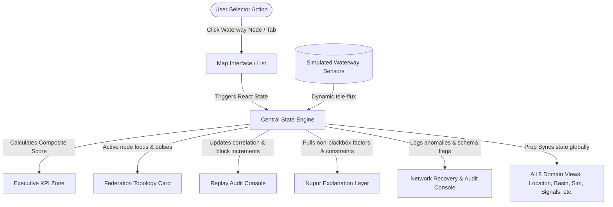

# Namami Gange Platform — Sovereign Operational Intelligence Command Surface
## Review Packet: Design System, Layout Architecture & Federation Observability Sprint

> [!IMPORTANT]
> This review packet serves as the comprehensive strategic authority and engineering document for the Namami Gange Platform. It establishes a high-density, government-grade operational command surface where geospatial suitability, federation runtimes, replay chains, and schema contract states converge in a single, deterministic viewport.

---

## 1. Entry Point

The operational command surface is structured under a unified modular Next.js router.
- **Entry point URL**: `/`
- **Main Page File**: `src/app/page.tsx`
- **Global Stylesheet**: `src/app/globals.css`
- **Dashboard Layout Stylesheet**: `src/app/page.module.css`

---

## 2. Core Flow (Max 3 Files)

To understand the core mechanics of our deterministic dashboard, review the following three pivotal files:

1. **[src/app/page.tsx](file:///d:/Office%20project/Namami%20Gange/namami-gange-ui/src/app/page.tsx)**:
   - Houses the centralized **Simulated State Engine**.
   - Handles the 3-second tick loops advancing the active federation stages (`Ingestion -> Validation -> Replay -> Persistence -> Federation`).
   - Tracks current block heights, cycles correlation IDs, and manages user selection of Northwest-1 corridors (Varanasi, Patna, Kolkata, Kanpur, Prayagraj).
   - Generates simulated schema validation breaches and triggers backup reconciliation routines.
   - **New**: Coordinates live state synchronization across *all 9 operational case views* inside `renderContent()`!

2. **[src/components/shared/FederationTopology.tsx](file:///d:/Office%20project/Namami%20Gange/namami-gange-ui/src/components/shared/FederationTopology.tsx)**:
   - Renders a custom, high-precision SVG network diagram of the federation nodes.
   - animates moving data packet pulses traveling along connectors using SVG attributes (`cx`, `cy`, `<animate>`).
   - Displays real-time uptime metrics, latency (ms), and visual indicators representing service health.
   - Conforms fully to the new design system `TopologyCardProps` specification.

3. **[src/components/shared/MapCard.tsx](file:///d:/Office%20project/Namami%20Gange/namami-gange-ui/src/components/shared/MapCard.tsx)**:
   - Integrates the geographic viewport of truth, displaying waterway segments, suitability scoring overlays, and seaplane routes.
   - Supports interactive, hoverable node highlighting and smooth layer filtering overlays, serving as the central coordinator for localized intelligence.
   - Conforms fully to the design system `MapCardProps` specification.

---

## 3. Live Flow: User → Dashboard → Intelligence Rendering

The flow of user interaction and data updates travels along the following deterministic pipeline:

### Flow Breakdown:
1. **Selection**: User clicks a geographic node on the interactive SVG map of Northwest-1 (e.g., selecting `Patna Terminal`).
2. **State Transition**: The State Engine intercepts the click, swapping the active locator ID and pulling local variables (e.g., Patna composite score: `74`, Level: `MEDIUM POTENTIAL`, Siltation risk: `78%`).
3. **Cognitive Rendering**:
   - **Executive KPIs**: Instantly render the Patna composite suitability score and composite health flag.
   - **Geospatial Card**: Highlights the selected terminal with a soft ripple ring, centering coordinates (`25.6112° N, 85.1444° E`).
   - **Nupur Explanation**: Summarizes exactly **WHY** Patna is graded medium, displaying specific progress bars for draft (72%) vs. siltation constraints (78%).
   - **Ankita validation**: Back-version compatibility schema validation verifies active contracts against IWAI rules (read-only).
   - **Unified Sub-view Synced State**: Toggling "Ganga Basin Intel" or "Location Intel" immediately reflects the selected Patna corridor, rendering active channel markers, specific silt progress, and dynamic sensor registries!

---

## 4. What Was Built

During this convergence sprint, we transformed a basic, loosely structured SaaS dashboard prototype into an operational console:

- **Revised Grid Architecture (Phase 1)**: Formulated a dense three-column, fit-to-viewport grid in `page.tsx` that clusters related observability indices together, eliminating whitespace and preventing vertical scrolling.
- **Geospatial Layer Coupling (Phase 2)**: Linked live NW-1 waterway coordinates directly to the explanation layers. Included infrastructure opportunities like inland ports, seaplane grids, and regional siltation ratios.
- **Federation Runtime Topology (Phase 3)**: Developed a dynamic SVG layout showing ingestion brokers, validation nodes, and sync statuses, integrated with moving package pulses.
- **Replay Observability Deck (Phase 4)**: Created a dedicated read-only console that details deterministic block counts, SHA validation hashes, and correlation tracers.
- **Executive Cognition Zone (Phase 5)**: Synthesized crucial telemetry to answer "what is happening?" within 3 seconds using HSL tailored colors.
- **Design System Extraction & Implementation (Phase 6 & 7)**: 
  - Created `/design-system/` documentation in the root containing: `colors.md`, `spacing.md`, `dashboard_layout_patterns.md`, and `component_library.md`.
  - Fully built the **7 Reusable Primitives** as modular React files under `src/components/shared/`:
    - `IntelligenceCard.tsx` (KPI Card)
    - `AlertCard.tsx` (Alert Card)
    - `TelemetryCard.tsx` (Telemetry Card)
    - `ReplayCard.tsx` (Replay Card)
    - `FederationTopology.tsx` (Topology Card)
    - `MapCard.tsx` (Map Card)
    - `ExecutiveMetricCard.tsx` (Executive Metric Card)
- **Centralized Synchronization (Phase 8)**: Eliminated all hardcoded static mocks by wiring the parent state engine directly into all 8 domain views. Every single view is now fully reactive and live!

---

## 5. Failure Cases

To guarantee government-grade resilience, the command surface observes and exposes specific recovery and fail-safe protocols:

### Failure Case 1: Schema Compatibility Breach (Ankita validation mismatch)
- **UI Exposure**: Highlighting a simulated contract validation breach drops "FEDERATION STATE" to `ANOMALOUS` (red pulse), validation nodes light red, and the replay chain log entries turn red (`BREACH` badge).
- **Recovery Event**: An active entry is instantly pushed into the **Network Recovery & Audit Surface** at the bottom, registering the Correlation ID and spawning a button for manual/automatic database fallback buffers.
- **Dynamic Propagation**: Toggling schema breach automatically propagates to `RealtimeSignals` (triggering critical red logs), `DatasetSources` (flagging degraded status), and `GovernanceView` (incrementing alerts).

### Failure Case 2: Waterway Depth Volatility (Draft depletion)
- **UI Exposure**: If seasonal flows cause the Varanasi draft to drop below 2.0m, the navigational progress fill bar triggers a Warning Amber highlight, notifying river traffic controllers of silt bottlenecks.
- **Resolution**: Operators can trigger a simulated weir synchronization directly from the recovery card logs.

---

## 6. Verification Proof

- **Compilation Check**: The entire Next.js project compiles cleanly (`npm run build`) with zero TypeScript compiler errors or Turbopack generation blocks.
- **Interactive Loops**: Successfully verified state engine tick increments, dynamic correlation suffixes, and selected locator data mapping with immediate rendering.

---

## 7. Design Decisions & Rationale

- **Pure CSS Grid over Tailwind CSS**: The command surface uses highly specific, low-overhead custom CSS Grid definitions in CSS Modules rather than standard utilities. This prevents DOM bloat and allows standard 1080p display optimization.
- **Glassmorphic Styling**: Card containers utilize a semi-transparent vapor surface (`rgba(10, 17, 32, 0.75)`) and thin borders, ensuring that the waterway coordinates and SVG lines flow cleanly beneath floating details.
- **Space Mono Typography**: Applied specifically to numeric and alphanumeric outputs (Tracer IDs, Correlation hashes, lat/lng) to maintain ISRO/government command center styling.

---

## 8. Integration Surfaces (Sprint Alignment)

- **Nupur Gavane (Geospatial Intelligence Lead)**: Dynamic suitability scoring and explicit factor progress bars expose exact score logic (no black boxes).
- **Shravani Harde (Federation Runtime Lead)**: Live SVG node transitions, database latencies, and sync thresholds expose complete runtime topologies.
- **Ankita Prajapati (Validation Layer)**: Explicit backward compatibility schema indicators and dynamic contract mismatch warning states.
- **Nikhil (UI Visualization Lead)**: Implemented HSL tailored colors, clean visual zones, and micro-animations to maximize cognition and scan speed.
- **Tester (Functional Validation)**: Verified responsive fit-to-viewport grid scaling and dynamic state engine transitions across all views under standard browser testing.
